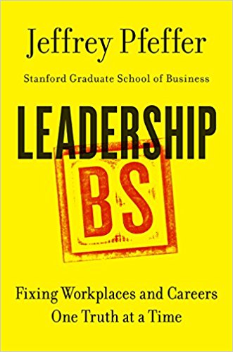
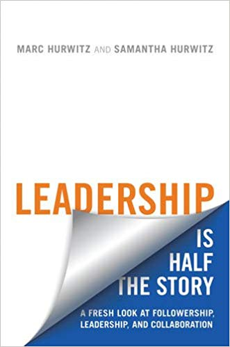
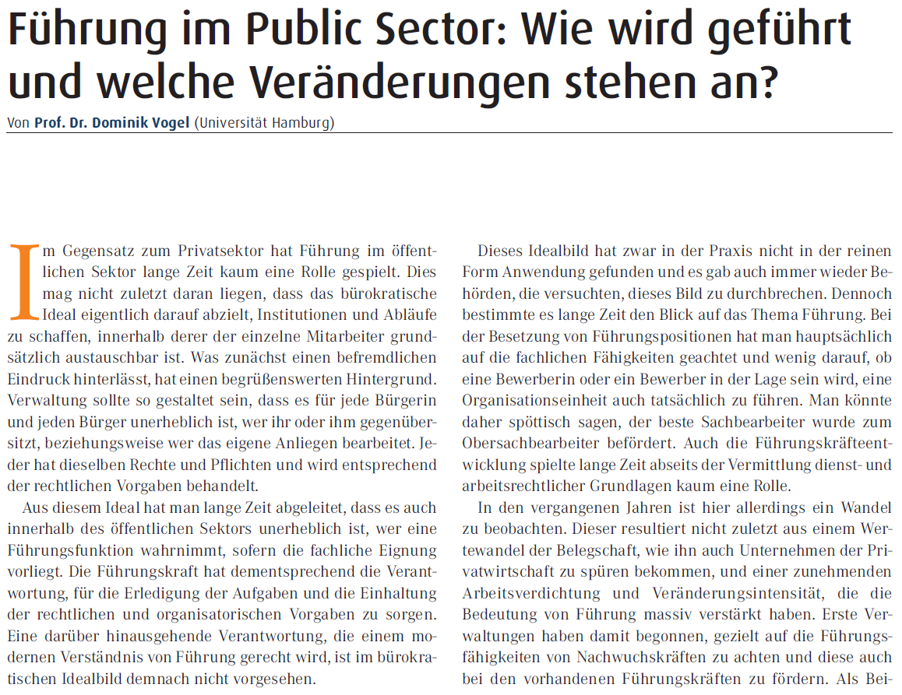
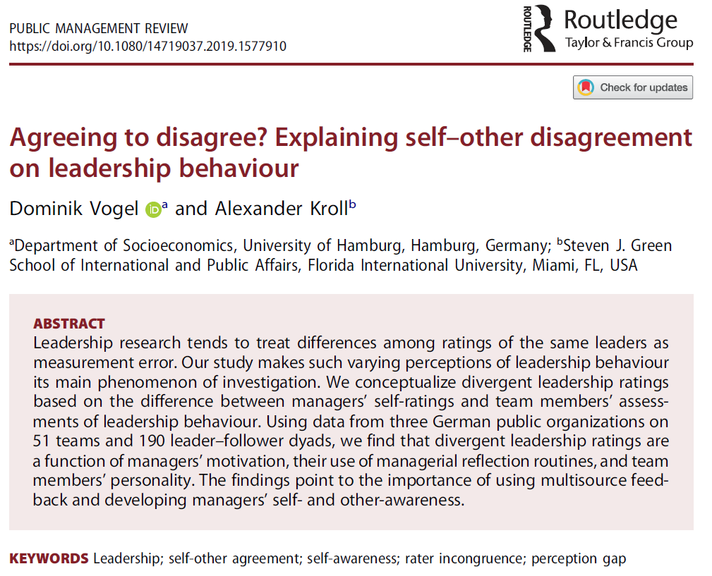
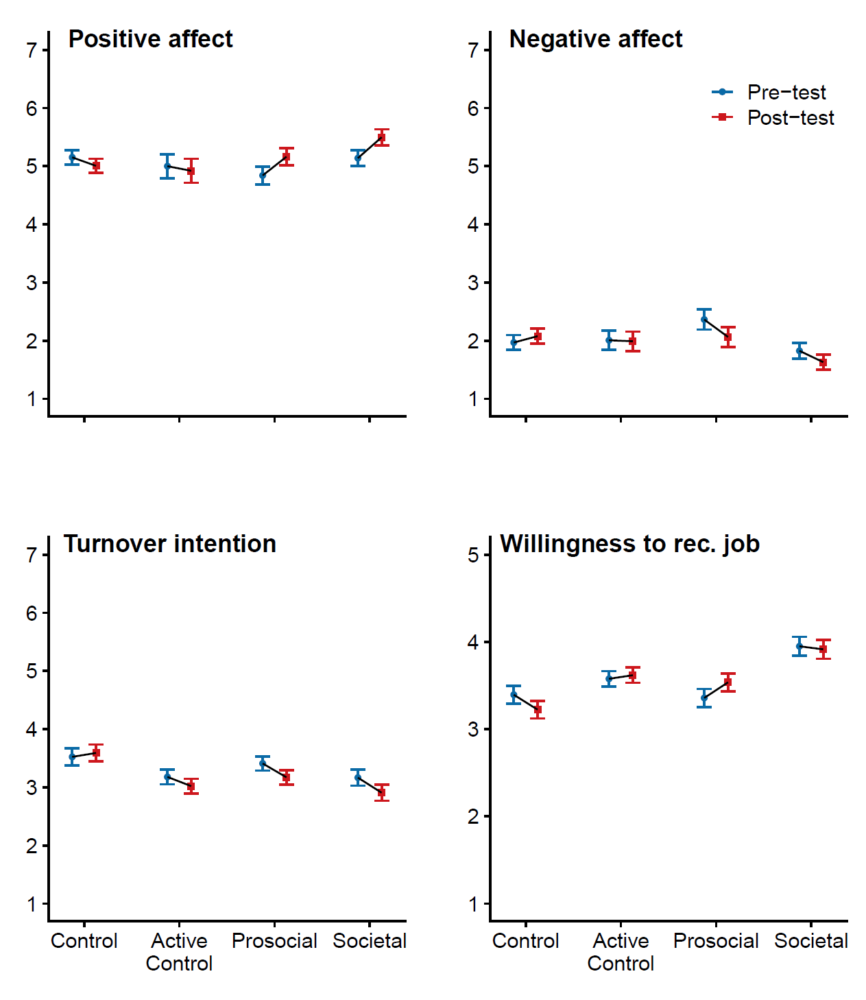

class: inverse, center, middle

# Über mich

```{r setup, include=FALSE}
options(htmltools.dir.version = FALSE)
```

```{r, include=FALSE, echo = FALSE}
library(tidyverse)
library(cowplot)
library(ggrepel) 
```


---

# Über mich

__Juniorprofessor__ für Public Management, Uni Hamburg

Studium der __Politik- und Verwaltungswissenschaft__ in Konstanz, Enschede und Potsdam

__Promotion__ zu Führung im öffentlichen Sektor (Universität Potsdam)


---

# Meine Forschungsschwerpunkte

Verhalten und Einstellungen von Beschäftigten und Führungskräften im öffentlichen Sektor (*&bdquo;Behavioral Public Administration&ldquo;*)

Führung

(prosoziale) Motivation, Meaningfulness

Personalmanagement

Performance Management

Digitalisierung

Interaktion von Bürger*innen und Verwaltung


---

class: inverse, center, middle

# Was treibt die Führungsforschung um?


---

# Puh. Gute Frage

Mehr als __2.200 neue begutachtete Artikel__ mit dem Schlagwort &bdquo;Leadership&ldquo; im Titel in 2018.

__Zusätzlich 800__ Buchkapitel, Konferenzpapiere, Buchbesprechungen, ...

Da fällt es schwer, den Überblick zu behalten

---
# Eine subjektive Zusammenfassung 

Thema 1: __Kritische Selbstreflexion__

* Messen wir in unseren Studien wirklich Führung?
* Können wir tatsächlich kausale Aussagen treffen?
* Wie robust sind unsere Erkenntnisse?
* Wie können wir in diesen Punkten besser werden?

<center> 


---

# Thema 1: Messen wir wirklich Führung?

__Messen ist unglaublich schwierig__ &ndash; Insbesondere bei Dingen, die man nicht anfassen kann

Messung erfolgt i.d.R. über __Fragebögen__

Entwicklung der Fragebögen ist hochgradig __spezialisiertes Handwerk__

__Vier Phasen__: Theorieentwicklung, Fragenentwicklung, Validierung des Inhalts, Empirische Evaluation

__18 kritische Checks__ notwendig

Die Mehrheit der in Wissenschaft und Praxis verwendeten Fragebögen sind nicht so entwickelt, wie sie sollten.

.footnote[
.small[Crawford, Joseph A. und Jo-Anne Kelder. 2019. „Do we measure leadership effectively? Articulating and evaluating scale development psychometrics for best practice.“ The Leadership Quarterly 30 (1): 133–44.]
]

---

# Thema 1: Kausale Aussagen?

Es ist sehr __schwer__ tatsächlich kausale Zusammenhänge zu belegen

__Korrelation ist nicht Kausalität__ (&bdquo;post hoc, ergo propter hoc&ldquo;)

Hauptproblem: __Endogenität__ (unbeobachtete Variable erklärt gefundenen Zusammenhang)

Auch objektive (z. B. Performance) und Zeitreihendaten __helfen nicht__

__Auswege__: Experimente oder statistische Korrekturen (Instrumentenvariablenansatz, Propensity Score Analysis, Regression Discontinuity, Difference-in-Differences Models, Heckman selection Models)

__Probleme__: Korrekturverfahren sind sehr schwer korrekt umzusetzen und haben Nebeneffekte

__Lösung__: Pluralität von Methoden, Transparenz, gute Theorien und Akzeptanz von Unsicherheit

---

# Thema 1: Wie robust sind unsere Erkenntnisse?

Vermutlich __weniger als erhofft__

Forschung __entwickelt__ sich immer weiter

__Verbesserungsmaßnahmen__ sind eingeleitet:

* Fokus auf bessere Theorien
* Fortschritte bei der Analyse
* Mehr Transparenz
* Replikationen
* Langsame Abkehr von Fokus auf spektakuläre Ergebnisse hin zu überzeugenden Designs
* Betrugsfälle haben Sensibilität erhöht

---

# Eine subjektive Zusammenfassung

Thema 2: __Die Rolle der Geführten (&bdquo;Followership&ldquo;)__

* Welche Rolle spielen die Geführten für den Erfolg von Führung?
* Wie beeinflussen die Geführten die Führungskraft?
* Was ist ein guter Follower / eine gute Followerin?
* Wie formt man ein Umfeld, indem gutes Followership entsteht?
* Organisationserfolg hängt nicht alleine an den Führungskräften
* Welches Verhalten von Geführten trägt zum Organisationserfolg bei?

<center> 
 


---

# Thema 2: Followership

**Ohne Geführten keine Führung**

**Typologie**: Isolate, Bystander, Participant, Activist und Diehard<sup>1</sup>

Geführte haben durch **Rollenorientierung** Einfluss auf Erfolg von Führung:<sup>2</sup> 

* *Interaktive* Rolle (unterstützt und ergänzt Führungsrolle)
* *Unabhängige* Rolle (hohe Autonomie, positive Einstellung, hohe Kompetenz, ergänzt Führungsrolle)
* *Negativ unabhängige* Rolle (arbeitet gegen die Führungsrolle)
* *Wechselnde* Rolle (wechselt zwischen Geführten- und Führungsrolle) 

Followership nimmt Geführte in die **Mitverantwortung** und stellt Frage nach Rolle der Geführten in Führungskräfteentwicklung

.footnote[
.small[<sup>1</sup> Kellerman, B. 2008. Followership: How Followers Are Creating Change and Changing Leaders. Boston. HBP.]<br>
.small[<sup>2</sup> Howell, Jon P. und M. Mendez. 2008. „Three Perspectives on Followership.“ In The art of followership, hg. v. Ronald E. Riggio, Ira Chaleff und Jean Lipman-Blumen. 1. Aufl., 25–39. San Francisco: Jossey-Bass.]
]

---

# Eine subjektive Zusammenfassung

Thema 3: Die Rolle von **sozialer Identität** und Gruppenprozessen

* Menschen bilden eine soziale Identität, die auf der **Zugehörigkeit zu Gruppen** basiert
* Menschen kategorisieren andere nach ihrer Gruppenzugehörigkeit (**&bdquo;In-Group&ldquo; vs. &bdquo;Out-Group&ldquo;**)
* Führungskräfte sind besonders erfolgreich, wenn sie als **prototypisch** für eine soziale Gruppe wahrgenommen werden

<center> 
 

---

# Theorien / Ansätze mit hoher Forschungsaktivität

.pull-left[
Transformationale / charismatische Führung

Authentische Führung

Servant Leadership

Leader&ndash;Member Exchange (LMX)

Leadership Emergence
]

.pull-right[


]
---

# Theorien / Ansätze mit hoher Forschungsaktivität

.pull-left[
Führungssubstitute

Führung aus der Ferne

Selbstorganisierte Teams

Dark und abusive Leadership
]

.pull-right[


]

---


class: inverse, center, middle

# Und der öffentliche Sektor?

---

## Forschungsbedarf ist groß

```{r comment='#', echo=FALSE, fig.width = 8, fig.retina=2 }
df <- tibble::tibble(Anzahl = c(651, 418, 201, 102, 65),
                     Bereich = factor(c("Management", 
                                                 "Education", 
                                                 "Psychologie", 
                                                 "Nursing", 
                                                 "Öffentlicher\nSektor"),
                                      levels = c("Management", 
                                                 "Education", 
                                                 "Psychologie", 
                                                 "Nursing", 
                                                 "Öffentlicher\nSektor")))
ggplot(data = df,
       aes(y = Anzahl, x = Bereich, 
           color = Bereich, 
           fill = Bereich)) +
  geom_bar(stat="identity") +
  labs(title = "Veröffentlichungen mit 'Leadership' im Titel in 2018",
       x = "",
       y = "Veröffentlichungen in begutachteten Zeitschriften") +
  geom_text(aes(label=Anzahl), vjust=-0.5, size=5, color = "black") + 
  theme(legend.position="none",
        plot.title = element_text(size = 18,
                                  face = "bold"),
        axis.title = element_text(size = 18,
                                 face = "bold"),
        axis.text.x = element_text(size=16),
        axis.text.y = element_text(size=16)) +
  scale_fill_viridis_d(direction = -1) + 
  scale_color_viridis_d(direction = -1) 
  

```


---

# Es gibt Hoffnung

```{r echo = FALSE, fig.retina=2}
df <- tibble::tibble(Anzahl = c(65, 31, 19, 8, 10),
                     Jahr = c(2018, 2013, 2008, 2003, 1998))
ggplot(data = df,
       aes(y = Anzahl, x = Jahr, label=Anzahl,
           group = 1)) +
  geom_line(color = "#440154FF") +
  geom_point(color = "#440154FF") +
  labs(title = "Veröffentlichungen im Bereich 'Public Administration' \nmit 'Leadership' im Titel",
       x = "",
       y = "Veröffentlichungen in begutachteten Zeitschriften") +
  scale_fill_viridis_d(direction = -1) + 
  scale_color_viridis_d(direction = -1) +
  scale_x_continuous(breaks = c(1998, 2003, 2008, 2013, 2018),
                     labels=c(1998, 2003, 2008, 2013, 2018)) +
  geom_text_repel(size=7, color = "#440154FF", hjust = 0) + 
  theme(legend.position="none",
        plot.title = element_text(size = 18,
                                  face = "bold"),
        axis.title = element_text(size = 18,
                                 face = "bold"),
        axis.text.x = element_text(size=16),
        axis.text.y = element_text(size=16)) 
  
```

---

# Aktuelle Themen in der Public Leadership Forschung

Was ist das **Besondere** an Führung im öffentlichen Sektor?

Welche Erkenntnisse aus der **allgemeinen Führungsforschung** können wir in den öffentlichen Sektor übertragen

**Selbst- und Fremdwahrnehmung** von Führungskräften

Wirksamkeit von **Führungskräfteentwicklung**

---

class: center, middle, inverse

# Hier kommt meine / unsere Forschung ins Spiel

---

# Was ist besonders an Public Leadership?

.pull-left[
**Fachliche** Anforderungen

**Ethische** Ansprüche

**Rechtlicher** Rahmen und Verantwortung für Einhaltung

**Politische Loyalität**

**Verantwortlichkeit** gegenüber demokratischen Institutionen und Öffentlichkeit

Einbeziehung von **Stakeholdern** bei der Aufgabenerfüllung
]

.pull-right-tiny[

<center> 

</center>
.tiny[Vogel, Dominik. 2017. &bdquo;Führung im Public Sector: Wie wird geführt und welche Veränderungen stehen an?&ldquo;. PERSONALquarterly 69 (1): 15-19.]

]

---

# Selbst- und Fremdwahrnehmung

.pull-left[
**Differenz** Selbst- und Fremd-wahrnehmung erstaunlich hoch

Mögliche Ursachen: 

* Geringe Nutzung von **Feedback-Instrumenten**
* **Führungskräfteentwicklung** wenig verbreitet
* **Kommunikation** ausbaufähig
* **Wertschätzung** von Führung als eigene Aufgabe selten

Steuerungsinstrumente verringern Differenz

Führungsmotivation verringert Differenz
]

.pull-right-tiny[

<center> 

</center>
.tiny[Vogel, Dominik und Alexander Kroll. 2019. „Agreeing to disagree? Explaining self-other disagreement on leadership behaviour.“ Public Management Review. doi:10.1080/14719037.2019.1577910.]

]

---

class: center, middle, inverse

# Motivation als entscheidender Faktor für den Organisationserfolg


---

# Eine besondere Motivation im öffentlichen Dienst?

Sehr viel Forschung zur spezifischen Motivation von Beschäftigten im öffentlichen Dienst

Resultat: **Public Service Motivation** (PSM)

* Attraktivität von Politik und Politikgestaltung
* Gemeinwohlorientierung
* soziales Mitgefühl
* Uneigennützigkeit/Altruismus

Beschäftigte mit hoher PSM zeigen bessere **Leistungen**, sind **zufriedener**, fühlen sich ihrem Arbeitgeber stärker **verbunden**

---

# Motivationsfaktor Impact

.pull-left[
**Prosozialer Impact**: 

   Die Erfahrung, durch die eigene Arbeit einen positiven Einfluss auf das Leben anderer ausüben zu können.
   
   

]

.pull-right[

**Gesellschaftlicher Impact**

   Die Erfahrung, durch die eigenen Arbeit einen positiven Einfluss auf die Gesellschaft insgesamt ausüben zu können.


]

---

# Betonung des Impacts als Führungs-instrument

.pull-left[
Beschäftigte, die darüber reflektieren, welchen Impact sie haben, haben ein größeres **Wohlbefinden**, sind **weniger geneigt, zu kündigen** und sind eher bereit, ihren **Job anderen zu empfehlen**.
]

.pull-right-tiny[

<center> 

</center>
]


---

# Einladung zur Diskussion

.pull-left[
Was ist neu für Sie und regt Sie mit Bezug auf die eigene Arbeit zum __Nachdenken__ an?

Sehen Sie andere __Motivationsaspekte__ die für Ihre Mitarbeiter\*innen wichtig sind?

Betonen Sie den __Impact__ der Arbeit Ihres Teams? Hat das positive Effekte?

Helfen Ihnen __Feedbackinstrumente__?
]

.pull-right[
Provokante Thesen:

* Alles __Elfenbeinturm__
* Führung funktioniert nur durch Kontrolle und nicht durch __Impact-Blabla__
* __Prototypisch__ für ein Team wäre eine sicherheitsorientierte FK ohne Motivation
* Führung ist __überall dasselbe__
* Selbst- und Fremdwahrnehmung fallen auseinander, weil mein __Team keine Ahnung__ hat, was ich täglich leiste
]


---


class: center, middle

# Vielen Dank!

<a href="mailto:dominik.vogel-2@uni-hamburg.de"><i class="fa fa-paper-plane fa-fw"></i>&nbsp; dominik.vogel-2@uni-hamburg.de</a><br>
<a href="https://vogel-online.info"><i class="fa fa-link fa-fw"></i>&nbsp; vogel-online.info</a><br>
<a href="http://twitter.com/DominikVogel86"><i class="fa fa-twitter fa-fw"></i>&nbsp; @DominikVogel86</a><br>
